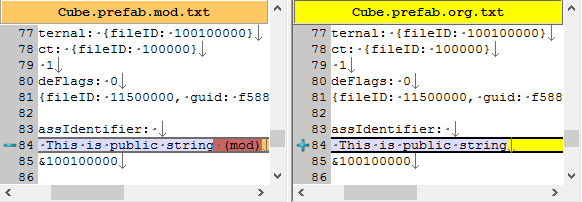

## EditorWindow的数据持续性 ##

**静态属性**：Unity编译后初始化，切换Run状态仍然保持修改，直到程序退出时清空。

**成员属性**：实例化时初始化，关闭窗口时销毁。新打开的窗口属性与原窗口无关。

**自动序列化**：因为编辑器窗口的属性在Unity中没有修改界面，代码的meta文件也不能存储属性，因此对编辑器窗口来说，自动序列化是不存在的。

**手工序列化**：为了保持一些成员属性的持续性，可以利用任何数据保留模块完成序列化。比如使用Unity内部的设置模块，或者自己读写外部文件等。

**参考** Prefab中对脚本组件的序列化

左图 修改了一个参数
有图 未修改任何参数

可见，Prefab并非只序列化修改参数，而是将所有脚本属性序列化一次。
